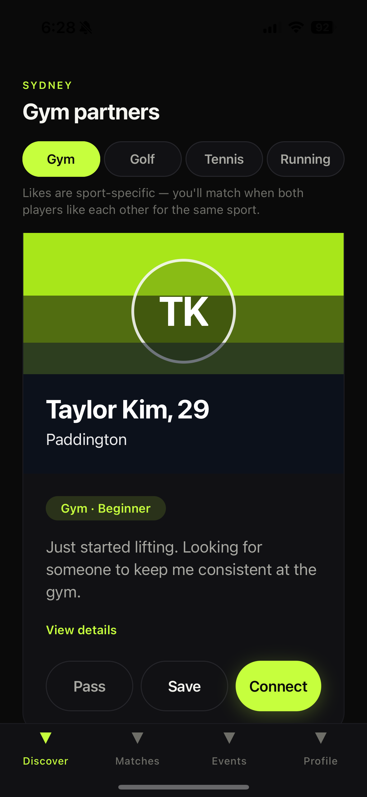
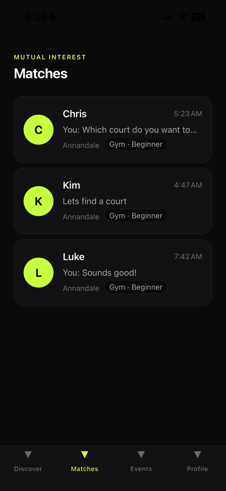
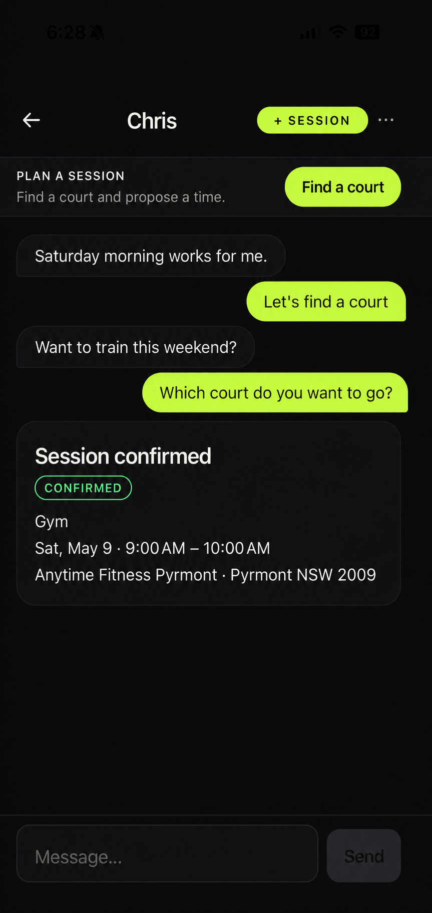
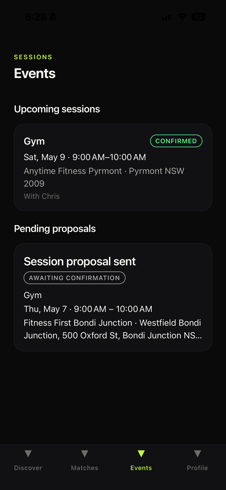
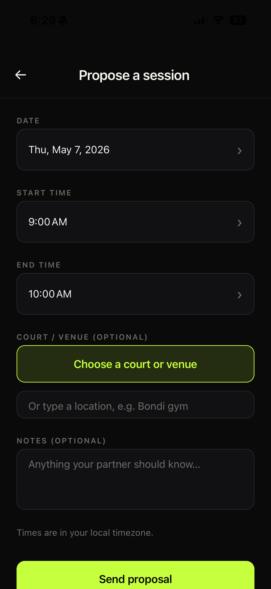
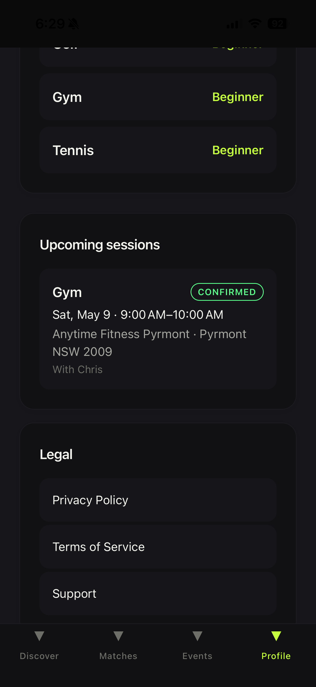
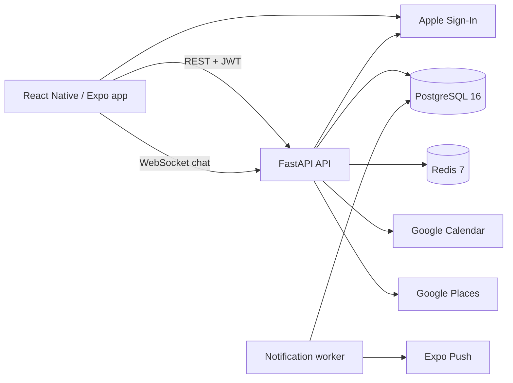

# Protin

**A mobile social fitness platform for finding training partners and organising sports sessions.**
Protin ranks potential partners by sport, skill level and training-time overlap, then carries them
all the way through messaging, session scheduling, group games and a reputation system that
rewards actually showing up.

`React Native` · `Expo 54` · `TypeScript` · `FastAPI` · `PostgreSQL 16` · `Redis 7` · `Docker`

[](https://github.com/EdwardH-jedi/Protin/actions/workflows/ci.yml)


> Independently designed and built. The app is prepared for App Store submission under
> the brand **SportsGang** — store metadata, privacy labels and a release gate checklist
> live in [`docs/release`](docs/release) — but no build has been submitted or released.
> `protin` remains the internal project and package namespace.

---

## Screens

| Discovery | Matches | Chat |
|---|---|---|
|  |  |  |

| Events & sessions | Propose a session | Profile & account |
|---|---|---|
|  |  |  |

<sub>iOS simulator captures from the release-review build.</sub>

---

## Overview

Finding someone to train with is a coordination problem that no single app solves well.
People discover partners in one place, argue about times in another, and track who
actually turned up nowhere at all. Group sports make it worse: casual games need a
roster, a venue and some assurance that the strangers involved will show.

Protin puts that whole loop in one app — discovery, agreement, scheduling and
accountability — and keeps it local, so the people it surfaces are ones you could
realistically meet this week. The product is Sydney-first by design: the venue catalogue,
suburb model and distance filters are all built around one city rather than pretending
to global coverage on day one.

It is deliberately **not** a dating app. Matching exists to produce a booked session,
and the reputation system exists to make that session actually happen.

---

## Key Features

**Discover & connect** — A sport-scoped partner feed with like / pass / save actions and
mutual-match creation. The feed *filters* on sport, active accounts, cards you have already
acted on, and blocks in both directions; it then *ranks* a capped pool of the 200 newest
remaining candidates by compatibility — 60% skill-level proximity, 40% preferred-time
overlap. Gender, age and distance preferences
are captured on the profile but are not yet applied to the feed. Supported sports: gym, golf,
tennis and running.

**Plan & book** — 1:1 session proposals governed by an explicit booking state machine.
Every transition is checked against both the current status and the acting party's role
(proposer vs partner), so a partner can confirm or decline but only the proposer can
withdraw. A confirmed booking can be exported to the user's Google Calendar.

**Compete & participate** — Group events ("battles") with rosters, capacity and attendance
checks; head-to-head challenges whose results are only applied once *both* participants
submit matching outcomes; and a feature-flagged tournament surface (list / join / leave,
with capacity enforced under row-level locking).

**Reputation with the incentives thought through** — Two subsystems, deliberately kept
apart. A *rank and honor ledger* accrues from booking outcomes, with tiers computed from
points rather than stored; because either party can unilaterally mark a confirmed session
completed or no-show, the deterrent there is game-theoretic — whoever claims a no-show
takes a smaller penalty too. A separate *competitive Honor System* (local rankings,
titles, win/loss streaks) is far more tightly gated: it is written only from the challenge
path, and only once *both* participants submit matching results. Mitigation, not a dispute
system — and the design notes say so.

**Communicate** — Real-time per-match chat over WebSockets, with participant-checked
rooms, REST history, optimistic send and message de-duplication across the
fetch / POST / socket paths. Inbound text passes content moderation.

**Trust & safety** — Reporting and blocking across users and events, blocked users
filtered out of the discovery feed in both directions, and in-app account deletion that
hard-deletes every row referencing the user in dependency order. For Sign in with Apple
users it also attempts token revocation first, best-effort: revocation is skipped when
Apple credentials are unconfigured and a failure is logged rather than aborting, so an
Apple outage can never trap a user in their account. Uploaded photo *files* are not yet
purged from disk on deletion — a known gap, tracked rather than glossed over.

**Venues & integrations** — Nearby-venue discovery backed by a seeded Sydney catalogue
with an optional Google Places provider layered on top, Apple Sign-In, and Expo push
notifications delivered by a background worker.

---

## Tech Stack

| Area | Technology |
|---|---|
| **Client** | React Native 0.81 · Expo 54 · React 19 · TypeScript 5.9 · React Navigation 6 · Zustand 5 |
| **Backend** | Python 3.12 · FastAPI · Pydantic 2 · SQLAlchemy 2 (async) · Alembic · uvicorn |
| **Data** | PostgreSQL 16 (asyncpg) · Redis 7 |
| **Auth** | JWT (PyJWT) · bcrypt via passlib · Sign in with Apple |
| **Infrastructure** | Docker (multi-stage) · Docker Compose · nginx · Fly.io config |
| **Testing** | pytest · pytest-asyncio · httpx · Jest · jest-expo · React Native Testing Library |
| **Tooling** | Ruff · ESLint · tsc · GitHub Actions · npm workspaces · uv |
| **External** | Apple Sign-In · Google Calendar · Google Places · Expo Push · Sentry |

Versions above are read from the committed manifests, not from memory.

---

## Engineering Highlights

The parts of this repository worth looking at, and where to find them:

| Area | What is there | Where |
|---|---|---|
| **Async API** | FastAPI with fully async SQLAlchemy 2.0 over asyncpg; 15 routers, 14 ORM model modules, 17 service modules | [`apps/api/app`](apps/api/app) |
| **Booking state machine** | Transitions declared as a `(status, transition) → allowed_by` table and enforced centrally, so no route can invent an illegal state change | [`services/bookings.py`](apps/api/app/services/bookings.py) |
| **Contract-typed integration** | A TypeScript package pins the API wire shapes and is imported by ~22 mobile modules, so a contract change surfaces as a build failure rather than a runtime error. Adoption is partial and the types are not OpenAPI-generated — both gaps are documented rather than glossed over | [`packages/shared-types`](packages/shared-types) |
| **Security engineering** | Central protected-environment startup validation for JWT, internal-service and Fernet secrets; encrypted OAuth tokens; trusted-proxy-aware rate limiting; one-time Google OAuth state with PKCE | [`core/protected_config.py`](apps/api/app/core/protected_config.py), [`core/rate_limit.py`](apps/api/app/core/rate_limit.py), [`services/google_calendar.py`](apps/api/app/services/google_calendar.py) |
| **Real-time chat** | A WebSocket room per match; the client sends its JWT in the first application message rather than the URL, and the server verifies token, active account and match participation before joining the room | [`routers/chat.py`](apps/api/app/routers/chat.py), [`ChatScreen.tsx`](apps/mobile/src/screens/chat/ChatScreen.tsx) |
| **Background processing** | A standalone worker process polling for due push notifications and delivering them via Expo | [`apps/api/worker.py`](apps/api/worker.py) |
| **Schema evolution** | 16 Alembic migrations covering the full domain history | [`apps/api/alembic/versions`](apps/api/alembic/versions) |
| **Mobile app** | Expo / React Native with React Navigation, Zustand stores, Apple Sign-In, expo-location, maps, image picker and Sentry | [`apps/mobile/src`](apps/mobile/src) |
| **Test suite** | 660 API tests pass locally (plus three PostgreSQL-only tests skipped without a database) and 747 mobile tests pass; CI is configured to run the PostgreSQL-only tests against PostgreSQL 16 | [`apps/api/tests`](apps/api/tests), [`apps/mobile/src/__tests__`](apps/mobile/src/__tests__) |
| **Infrastructure** | Multi-stage Docker build, Compose stacks for local and staging, nginx reverse proxy, backup/restore and health-check scripts, Fly.io deployment configuration | [`infra`](infra), [`fly.toml`](fly.toml) |
| **Security review** | A written security audit with severity ratings, tracked against the code that since addressed it — including which findings are closed, which are only partially addressed, and which remain open | [`docs/security/SECURITY_AUDIT.md`](docs/security/SECURITY_AUDIT.md) |

---

## Architecture



- **Mobile app** — all user-facing state and navigation. Talks to the API over REST with a
  JWT held in `expo-secure-store`; holds no business rules of its own.
- **API** — the single source of truth for domain rules: authentication, the booking state
  machine, discovery filtering and scoring, challenge result verification, and rank/honor
  accounting. It owns the server-side integrations (Apple token verification and
  revocation, Google Calendar, Google Places). The app owns the ones that are inherently
  on-device: the Apple sign-in prompt, Expo push-token registration, device calendar
  access, and Sentry.
- **PostgreSQL** — durable state for users, profiles, matches, messages, bookings, events,
  challenges, tournaments, rankings, venues and safety records.
- **Redis** — rate-limit state and a health-checked runtime dependency.
- **WebSockets** — chat runs over an authenticated socket per match room, alongside the
  REST endpoints that serve message history.
- **Worker** — a separate process that polls for due notifications and delivers them
  through Expo Push, keeping fan-out off the request path.
- **shared-types** — a TypeScript package consumed by the mobile app that pins the wire
  contract. It is not generated from OpenAPI and a few newer hooks still declare shapes
  inline; see [the architecture notes](docs/ARCHITECTURE.md#package-boundaries-and-the-shared-type-contract).

Full detail: [`docs/ARCHITECTURE.md`](docs/ARCHITECTURE.md).

---

## Current Status

**Active — v1 implementation present, security rehabilitation verified in CI, not
released.** Locally, 1,407 automated tests pass; three PostgreSQL-only concurrency tests
skip because no local PostgreSQL or Docker daemon is available, and pass against
PostgreSQL 16 in CI. No App Store or TestFlight build has been submitted,
and the API is not verifiably deployed: the Fly.io configuration exists but the service
did not respond when checked. The only currently live deployment is the Netlify
marketing/legal site the app links to.

Remaining work includes submission mechanics and the gaps in
[Known Limitations](#known-limitations).

Full breakdown, including what is partially implemented and the validation evidence
behind these claims: [`docs/PROJECT_STATUS.md`](docs/PROJECT_STATUS.md).

---

## Testing & Quality

The workflow defines eight jobs: API Ruff and pytest, mobile ESLint/typecheck/Jest, web
typecheck/build, PostgreSQL 16 migration/concurrency tests, and an API Docker image build
that also validates the rendered staging Compose exposure. All eight jobs passed on
commit `956c002` in [run 32553409076](https://github.com/EdwardH-jedi/Protin/actions/runs/32553409076).

| | Stack | Scope |
|---|---|---|
| **API** | pytest + pytest-asyncio, httpx `ASGITransport` | 660 tests pass locally and three PostgreSQL-only concurrency tests skip without `POSTGRES_TEST_URL`. Most tests drive the real ASGI app against in-memory SQLite; the CI-only group applies real migrations and locking against PostgreSQL 16. |
| **Mobile** | Jest (`jest-expo`) + React Native Testing Library | 747 tests across 53 suites covering screens, hooks, stores and pure logic. |
| **Static** | Ruff (lint + format), ESLint (`--max-warnings 0`), `tsc --noEmit` | Enforced on every push, not just on pull requests. |

Details and local commands: [`docs/engineering/TESTING.md`](docs/engineering/TESTING.md).

---

## Engineering Workflow

Implementation on this project is AI-assisted, and the interesting part is the
scaffolding built to keep that honest rather than the assistance itself.

- **Claude Code** performs implementation against scoped, file-owned agent definitions in
  [`.claude/agents`](.claude/agents), with domain rules encoded as reusable skills
  (booking state machine, discovery feed, API contract sync).
- **Deterministic gates** run automatically. A Stop hook lints, typechecks and
  secret-scans the working diff before a turn is allowed to finish. (A pre-commit and a
  post-edit hook are also configured but are currently mis-wired and do not fire — found
  while writing this up, and documented in the workflow notes rather than left as an
  unearned claim.)
- **Codex** reviews the resulting diff independently, writing a verdict report that blocks
  only on correctness, regression or security findings.
- **CI** is the final arbiter — nothing merges on a green local run alone.
- **Product direction, architecture, scope and final acceptance stay human-owned.**

None of this makes generated code correct by itself. It makes incorrect code
expensive to land, which is the property that actually matters.

See [`docs/engineering/AI_WORKFLOW.md`](docs/engineering/AI_WORKFLOW.md).

---

## Project Ownership

Protin is an independent solo project — no team. Product direction, system architecture,
data modelling, mobile and backend engineering, testing strategy, infrastructure and the
engineering workflow were all mine.

Implementation is AI-assisted (see the workflow section above); the design, review and
acceptance of that work are not.

Full ownership breakdown by area:
[`docs/PORTFOLIO_FACTS.md`](docs/PORTFOLIO_FACTS.md#5-technical-ownership).

---


## Running Locally

**Prerequisites:** Node.js 20+, Python 3.12+, [uv](https://docs.astral.sh/uv/), Docker Desktop.

```bash
# 1. Environment files (defaults work for local development as-is)
cp .env.example .env
cp apps/api/.env.example apps/api/.env
cp apps/mobile/.env.example apps/mobile/.env

# 2. Infrastructure — PostgreSQL on :5432, Redis on :6379
npm run infra:up
npm run infra:ps          # wait until both report "Up (healthy)"

# 3. Dependencies
npm install
cd apps/api && uv sync --dev

# 4. Migrations (from apps/api)
uv run alembic upgrade head

# 5. API (from apps/api)
uv run uvicorn app.main:app --reload --port 8000
# → http://localhost:8000/health   ·   docs at http://localhost:8000/docs

# 6. Mobile app — in a second terminal, from the repository root
cd ../..
npm run mobile:start      # then press i (iOS), a (Android), or scan the QR code
```

Step 5 runs in the foreground, so start the app from a second terminal. Steps 4–5 run
from `apps/api`; everything else runs from the repository root.

Hitting a problem? See [`docs/engineering/LOCAL_SETUP.md`](docs/engineering/LOCAL_SETUP.md)
for environment variable reference and troubleshooting.

---

## Development Commands

```bash
# Infrastructure (each is its own command)
npm run infra:up          # start PostgreSQL + Redis
npm run infra:down        # stop, keeping volumes
npm run infra:reset       # wipe volumes and restart
npm run infra:logs        # tail service logs
npm run infra:ps          # service status and health

# Mobile — from the repository root
npm run lint      -w @protin/mobile
npm run typecheck -w @protin/mobile
npm run test:ci   -w @protin/mobile
npm run mobile:start      # also: mobile:ios, mobile:android, mobile:web

# API — from apps/api
uv run ruff check .
uv run ruff format --check .
uv run pytest
uv run alembic upgrade head

# API container — note the context is the repo root, not apps/api
docker build -f apps/api/Dockerfile .
```

---

## Repository Structure

```
apps/
  api/               FastAPI service — routers, services, models, migrations, worker
  mobile/            Expo React Native app — screens, hooks, stores, navigation
  web/               Vite marketing site — landing page with draft legal copy in modals
packages/
  shared-types/      TypeScript wire contract shared by the API and the app
infra/               nginx config, deploy / backup / health-check scripts, systemd units
docs/                architecture, engineering, deployment, security, legal, archive
.claude/             AI engineering harness — agents, skills, quality-gate hooks
.github/workflows/   CI pipeline
```

---

## Known Limitations

Stated up front, because they are the questions worth asking:

- **Not deployed and not released.** Fly.io configuration exists but the API did not
  respond when checked; no App Store or TestFlight build has been submitted. The project
  has never had a real user, so there are no usage, scale or performance figures anywhere
  in this repository.
- **Discovery ignores stated preferences.** Gender, age-range and distance preferences are
  captured on the profile but never read by the feed query.
- **Account deletion leaves photo files on disk.** Database rows are removed; uploaded
  images are not.
- **JWT sessions last seven days and have no refresh or revocation model.** Shortening the
  access-token lifetime safely requires a compatible mobile refresh-token flow.
- **Chat is single-instance.** The WebSocket connection manager lives in process memory —
  it does not survive a restart or scale horizontally.
- **Google Calendar is export-only**, and cancelling a booking does not remove the
  calendar event.
- **Tournaments are incomplete** and hidden behind a feature flag.
- **PostgreSQL and Docker cannot run on this local machine.** Those gates are instead
  verified by GitHub Actions against PostgreSQL 16 and the Docker runner.
- **The npm audit is not clean.** The current tree reports 30 advisories, including two
  critical transitive packages (`shell-quote` and `tar`); remediation needs a separately
  tested dependency-upgrade pass.

The full list, with the code behind each, is in
[`docs/PROJECT_STATUS.md`](docs/PROJECT_STATUS.md) and
[`docs/ARCHITECTURE.md`](docs/ARCHITECTURE.md#11-known-architectural-limitations).

---

## Documentation

**Canonical documents** — the authoritative source for anything about this project:

| Document | Contents |
|---|---|
| [Project Status](docs/PROJECT_STATUS.md) | Current state: what is implemented, partial, missing; validation evidence; deployment truth; known issues |
| [Architecture](docs/ARCHITECTURE.md) | System overview, components, request flow, data model, authentication, deployment, trade-offs, limitations |
| [Portfolio Facts](docs/PORTFOLIO_FACTS.md) | Repository-verified facts safe to reuse in portfolio materials — including claims that must **not** be made |

**Supporting documents:**

| Document | Contents |
|---|---|
| [Testing](docs/engineering/TESTING.md) | Test stacks, CI gates, local commands, mocking policy |
| [AI workflow](docs/engineering/AI_WORKFLOW.md) | Roles, quality gates, and the reasoning behind them |
| [Local setup](docs/engineering/LOCAL_SETUP.md) | Environment variables, health checks, troubleshooting |
| [Security audit](docs/security/SECURITY_AUDIT.md) | Reviewed findings, severities and remediation status |
| [Deployment](docs/deployment/RELEASE_RUNBOOK.md) | Release runbook and App Store submission prep |
| [Archive](docs/archive/README.md) | Superseded historical documents, retained for provenance |

---

## License

Source available, all rights reserved — see [LICENSE](LICENSE).
The code is public so it can be read and evaluated; reuse, redistribution and
commercial use require permission.

© 2026 Edward Hwang
