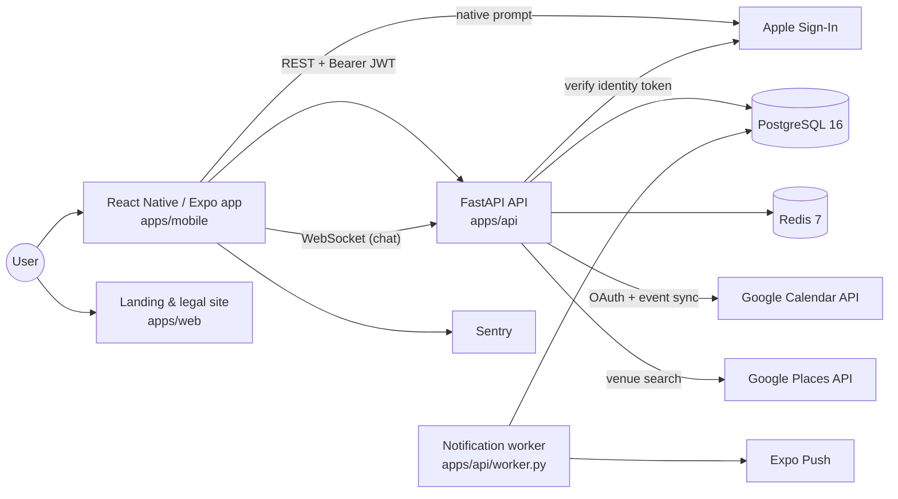

# Architecture

Last verified: 2026-08-21

How Protin is put together, and why. This describes the system as implemented today —
not a target state. Planned work is confined to [§12](#12-planned-architecture) and is
labelled as such.

---

## 1. System overview

Protin is a two-tier mobile application: an Expo / React Native client talking to a
FastAPI backend over REST and one WebSocket, backed by PostgreSQL for durable state and
Redis for rate-limit state. A second backend process delivers push notifications out of
band. A separately deployed public site hosts the legal pages the app links to; it is not
part of the product runtime.

All domain rules live server-side; the client renders what the API returns.

---

## 2. Architecture diagram

```
                 Mobile client (Expo / React Native)
                       |            |
        REST + JWT     |            |  WebSocket (chat, per match room)
                       v            v
                 +-------------------------+
                 |   FastAPI API           |
                 |   apps/api              |
                 +-------------------------+
                    |     |      |      |
     PostgreSQL <---+     |      |      +---> Google Calendar  (outbound export)
     (durable state)      |      +----------> Google Places    (venue search)
                          |      +----------> Apple            (identity token verify
     Redis <--------------+                                     + token revocation)
     (rate limits, health check)

                 +-------------------------+
                 |  Notification worker    |  polls notification_events
                 |  apps/api/worker.py     |  -> Expo Push
                 +-------------------------+
                          |
                          v
                     PostgreSQL

  Not part of the product runtime:
     apps/web  — Vite marketing landing page (local source; deployment target unverified)
     Public legal site at sportgang.netlify.app — live, referenced by the app's
     EXPO_PUBLIC_*_URL settings. The repo does not establish that it is built
     from apps/web.
```

The same view as a rendered diagram:



The mobile app is the only product surface. `apps/web` is a small Vite marketing site —
a single landing page that surfaces draft privacy, terms and contact copy in modals
rather than as routed pages. It is not a second client and holds no application logic.

The app's in-app legal links point at `https://sportgang.netlify.app/privacy/` and
siblings (set via `EXPO_PUBLIC_PRIVACY_URL` and friends). That site is live and serves
*routed* pages, which `apps/web` does not implement, and the repository contains no
Netlify configuration — so **the relationship between `apps/web` and the deployed site is
not established by this repository.** Treat them as separate artifacts.

---

## 3. Major components

### Mobile app — `apps/mobile`

Expo 54 / React Native 0.81 / React 19, TypeScript throughout.

- **Navigation** — React Navigation, native-stack plus bottom tabs, with a root navigator
  that switches on authentication state.
- **State** — Zustand stores for auth and profile, screen-local state elsewhere. There is no
  general-purpose cache layer, though a few module-level session caches exist (for example
  the tournament-availability probe in `useTournaments.ts`).
- **Auth token** — the JWT is *persisted* in `expo-secure-store` (Keychain / Keystore)
  rather than AsyncStorage. For the life of a session it is also held in memory — in the
  Zustand auth store and in a module-level `_token` in `lib/api.ts` that the request
  helper reads — and cleared from all three on logout and on account deletion.
- **Native capability** — Apple Sign-In, location, maps, calendar, image picker and push
  registration are all Expo modules, so the app builds through EAS without custom native
  code.
- **Business rules** — none that are authoritative. The app does mirror some server rules
  for display purposes (`eventHasStarted`, challenge terminal-status checks) to grey out a
  control before the user taps it, but every decision that matters — who may transition a
  booking, what a match is worth, whether a result counts — is made and re-checked
  server-side. A client that lied about any of them would simply get a 4xx.

### API — `apps/api`

FastAPI on Python 3.12, async end to end.

```
app/
  core/       config (pydantic-settings), JWT + password hashing, field encryption, rate limiting
  db/         async SQLAlchemy engine + session, Redis client
  models/     14 ORM model modules
  schemas/    Pydantic request/response models
  routers/    15 routers — the HTTP layer only
  services/   17 service modules — all domain logic
```

The intended layering is **routers do HTTP, services do domain work**: a router unpacks
the request, resolves the authenticated user, calls one service function and returns its
result. That is what makes a rule reachable from HTTP, from the worker and from a test
without duplication, and it is why the booking, discovery, challenge, rank, event and
safety domains all keep their logic in `services/`.

The boundary is not uniform, and it is worth being precise about where it is not. The
two oldest routers predate the convention: `routers/auth.py` runs its registration and
login queries inline, and `routers/users.py` does its own profile lookup and upsert. Both
work and both are tested, but neither has a service module, so that logic is reachable
only over HTTP. Extracting them is the obvious cleanup; it has not been done.

### Worker — `apps/api/worker.py`

A separate long-running process sharing the API's models and services. It polls
`notification_events` for due rows and delivers them through Expo Push.

Deliberately simple: no task queue, no distributed locking, a single poller on a
configurable interval. That is honest for the current volume, and the notification
service is already factored so a Celery/Redis queue could replace the polling loop
without touching the callers that schedule events.

Splitting it out matters more than what it runs on — push fan-out is slow and
failure-prone, and the booking request that triggers it should not wait for it.

---

## 4. Request and data flow

A representative write path — marking a session complete. (`/complete` is used here
rather than `/confirm` because it is the transition that exercises all three writes:
`proposed → confirmed` deliberately emits no reputation rows.)

```
POST /bookings/{id}/complete
   │
   ├─ get_current_user           JWT decoded, user loaded            core/security.py
   ├─ router                     validates the body, delegates       routers/bookings.py
   └─ services/bookings.py
        ├─ _get_booking_or_404
        ├─ _assert_booking_participant     caller is proposer or partner
        ├─ _check_transition               (status, target) legal? actor permitted?
        ├─ mutate booking.status                    not committed yet
        ├─ rank_service.record_booking_transition   rank/honor rows, same session
        ├─ notifications.schedule(...)              rows written, nothing sent
        └─ db.commit()                              all three land atomically
   │
   └─ 200  BookingResponse
```

The single commit at the end is the point: the status change, any reputation ledger rows
and any queued notifications either all land or none do. Committing the status first would
allow a session to be marked complete with no matching rank entry if a later step threw.

Not every transition writes all three. Reputation rows are emitted only on
`confirmed → completed`, `confirmed → no_show` and `confirmed → cancelled`; every
`proposed → *` transition, confirmation included, deliberately emits none. Notifications
are scheduled only for `confirmed`, `declined` and `cancelled`.

Push delivery happens later, out of band, when the worker next polls.

### The booking state machine

The HTTP surface is one route per action — `POST /bookings/{id}/confirm`, `/decline`,
`/cancel`, `/complete`, `/no-show` — but none of them decides anything. Each resolves to
a target status and hands off to a single `transition_booking` service function.

The rules live in one table: `(current_status, target_status)` mapped to which party may
perform the move (`proposer`, `partner` or `either`), checked before any state is
written. An illegal transition returns `422`; a legal transition attempted by the wrong
party returns `403`.

Encoding it as a table rather than scattering `if` statements across route handlers is
what keeps the rule auditable: the complete set of legal moves is readable in about
fifteen lines, and adding a status is a table edit rather than a hunt through the
codebase.

### Real-time chat

Messages have two paths in and one contract out. History and sending are ordinary REST
(`GET`/`POST /matches/{id}/messages`); delivery to the other participant is a WebSocket
room keyed by match id, held by an in-process connection manager.

Two details are worth calling out:

- **Authentication is the first application message.** The URL contains no bearer token.
  After the protocol handshake, the client has five seconds to send
  `{ "type": "auth", "token": "..." }`. The handler validates the JWT, active user and
  match participation before registering the socket with the connection manager. It
  closes invalid/unauthenticated sockets with `1008` and nonparticipants with `4003`;
  no chat data is accepted before `auth_ok`.
- **The client de-duplicates across three sources.** A message can arrive from the
  initial fetch, from the optimistic result of the client's own POST, and from a socket
  frame. `lib/messages.ts` merges all three into one ordered list rather than letting
  the screen render a duplicate.

The connection manager holds rooms in process memory, which means it does not survive a
restart and does not fan out across multiple API instances. A Redis pub/sub backplane is
the standard fix; it is not implemented, and the single-instance limitation is real.

### Rank and honor

There are two reputation subsystems with different trust models, and conflating them
would misrepresent both.

**Booking-derived rank and honor — `services/rank.py`.** `record_booking_transition` is
its only public emitter; the booking FSM calls it, and it writes `RankEvent` and
`HonorEvent` ledger rows in the same transaction as the status change. Two properties:

- **Tier is computed, never stored.** Deriving it from the point sum on read avoids a
  third source of truth that can drift out of sync with the ledger.
- **No-show claims cost the claimant too.** Either party may mark a confirmed session
  completed or no-show, so this input is effectively self-reported. The mitigation is
  that the caller takes a smaller penalty as well — a game-theoretic deterrent, not a
  dispute system. No dispute window is implemented, and the product copy says so.

**Competitive Honor System — `services/honor_system.py`.** Local rankings, titles,
win/loss streaks and `HonorHistory`. Its public API is **read-only**; the writer
(`record_match_result_for_honor`) has exactly one caller, `services/challenges.py`, which
fires it only once *both* participants have submitted matching results, and only on the
`accepted → verified` transition so a result can never be applied twice. A public
endpoint wrapping that writer would let any authenticated user mutate two other users'
rankings, streaks and title holdings — which is precisely why there isn't one.

---

## 5. Data model

The schema has 28 tables across nine domains. Only the entities that carry real
behaviour are listed; join and audit tables are folded into their owners.

| Domain | Key entities | Notes |
|---|---|---|
| Identity | `users`, `user_profiles`, `profile_photos`, `sport_profiles`, `identity_preferences` | One profile per user; one `sport_profile` per (user, sport). `identity_preferences` holds gender / age / distance preferences — captured but **not yet applied** to the discovery feed. |
| Discovery & matching | `discovery_actions`, `matches` | An action is (actor, target, sport, like/pass/save). A reciprocal like creates the `match` row that gates chat and bookings. |
| Messaging | `messages` | Scoped to a match. |
| Booking | `bookings`, `calendar_booking_syncs` | `bookings.status` is the state-machine field; the sync table maps a booking to its exported Google Calendar event. |
| Group play | `events`, `event_participants`, `tournaments`, `tournament_participants` | `events` are the group "battles"; tournaments are the feature-flagged V2 surface. |
| Competition | `sports_challenges`, `challenge_result_submissions` | Head-to-head; a result applies only when both submissions match. |
| Reputation | `rank_events`, `rank_profiles`, `honor_events`, `honor_history`, `honor_titles` | Two subsystems — see [§10](#10-key-technical-decisions). Ledger tables are append-only; tier is computed on read, never stored. |
| Safety | `reports`, `blocks` | Blocks are applied bidirectionally in the feed query. |
| Platform | `venues`, `push_tokens`, `notification_events`, `google_calendar_tokens`, `google_oauth_states` | `notification_events` is the worker's queue. OAuth tokens are Fernet-encrypted; OAuth state is hashed, expiring and one-time. |

Schema changes go through Alembic; there are 16 migrations and no manual DDL. Migration
`0016` adds participant inequality constraints, unique reputation-ledger keys and Google
OAuth state; it aborts rather than deleting incompatible historical rows.

### Data stores

**PostgreSQL 16** holds all durable state, accessed through async SQLAlchemy 2.0 over
asyncpg.

**Redis 7** backs rate-limit state and is health-checked on `/health`. That is currently
the extent of it — it is provisioned as the shared cache but nothing else uses it yet;
the Places lookup cache in `services/places.py`, for instance, is process-local rather
than Redis-backed, which does not survive a restart and is not shared across instances.
Nothing durable lives in Redis — losing it degrades the service, it does not lose data.

**Local media.** Profile photos are streamed into a staging directory with a 5 MiB
per-file and 16 MiB per-user limit. Pillow must decode JPEG, PNG or WebP content; dimensions
are capped at 6,000 pixels per side and 20 megapixels. New directories are promoted with
rollback/backup semantics so validation or database failure preserves the prior photos.
Files are served by `StaticFiles`; local disk remains a multi-instance limitation.

**Field-level encryption.** Google OAuth access and refresh tokens are encrypted at rest
with Fernet via a SQLAlchemy `TypeDecorator`, so the service layer reads and writes
plaintext and the ciphertext boundary sits at the column. With no key configured, values
carry a `plain:` sentinel prefix — and `validate_encryption_config()` refuses to start
the app in staging or production in that state. Staging is included deliberately: its
database dumps are retained as backups and would otherwise leak tokens.

---

## 6. Authentication

Two ways in, one token out.

- **Email + password** — `POST /auth/register` and `POST /auth/login`. Passwords are
  hashed with bcrypt via passlib. Registration requires a minimum length of 8 characters
  (`schemas/auth.py`); there is no complexity or breach-list policy. Both routes are rate
  limited (3/minute and 5/minute respectively).
- **Sign in with Apple** — `POST /auth/apple`. The client obtains an identity token from
  the native Apple prompt; the API verifies it and resolves or creates the user. The
  endpoint is disabled when `APPLE_CLIENT_ID` is unconfigured.

Apple identity tokens require the client nonce. The mobile client generates 32 secure
random bytes, while the verifier pins RS256 and validates issuer, audience, expiry, key
metadata and the nonce claim.

Both paths mint the same credential: an HS256 JWT carrying the user id as `sub`, valid
for 7 days, signed with `SECRET_KEY`. There is no refresh token, no revocation list and
no `jti` — a 7-day window is the whole session model. The client sends it as a bearer
token and stores it in `expo-secure-store`.

`GET /auth/me` returns the current user. `DELETE /auth/me` performs the in-app account
deletion App Store guideline 5.1.1(v) requires: it deletes rows across the main domains
explicitly, in dependency order, and relies on database-level cascades for the remainder.
For Apple users it first attempts token revocation on a best-effort basis (skipped when Apple credentials are unconfigured, and a failure is
logged rather than aborting, so an Apple outage cannot trap a user in their account).

One limitation is load-bearing enough to state here rather than only in
[§11](#11-known-architectural-limitations): uploaded photo *files* are not removed from
disk by account deletion. Protected environments do fail closed on weak/placeholder JWT
and internal-service secrets and malformed Fernet keys.

---

## 7. External services

| Integration | Used for | Absent key behaviour |
|---|---|---|
| Apple Sign-In | Identity-token verification at `/auth/apple`; token revocation on account deletion (App Store 5.1.1(v)) | Endpoint disabled; email/password unaffected |
| Google Calendar | OAuth connect with random, hashed, expiring, one-time state bound to the initiating user and redirect URI, plus S256 PKCE; outbound export of a confirmed booking. (`cancel_calendar_event` has no caller.) | Export disabled |
| Google Places | Live venue density for the venue picker | Falls back to the seeded Sydney catalogue, no HTTP call |
| Expo Push | Notification delivery from the worker | Defaults to the live Expo endpoint, so this one must be set *explicitly empty* to disable. Once empty: events are still scheduled and stored, and each delivery attempt returns failure and is recorded as such |
| Sentry | Mobile crash and error reporting | Not initialised |

These are *optional* integrations: leaving one unset switches that feature off, or
records a delivery failure, without breaking an unrelated flow. That is what lets CI, and
an App Store reviewer's environment, run the product without production credentials.

A separate class of setting behaves the opposite way on purpose. In `staging` and
`production`, centralized validation requires strong non-placeholder `SECRET_KEY` and
`INTERNAL_API_TOKEN` values and a constructible Fernet `FIELD_ENCRYPTION_KEY`; the app
raises at startup if any fail. Deployment preflight invokes the same validator before
migrations. Refusing to start is the correct failure mode for these trust boundaries.

---

## 8. Background and async work

One background process: the notification worker described in
[§3](#3-major-components). It polls `notification_events` for rows whose
`scheduled_at` has passed and whose `sent_at` is null, re-resolves the recipient's push
token, and delivers through Expo Push. Failures are recorded on the row; an event with
no usable token for more than 48 hours is marked failed rather than retried forever.

Nothing else runs asynchronously. There is no task queue, no scheduler and no cron
dependency — the worker is a plain `while` loop on a configurable interval.

---

## 9. Deployment architecture

Three environments exist in configuration, and they are in three different states. The
distinction matters, so it is stated precisely:

| Environment | Configuration | Verified state (2026-08-21) |
|---|---|---|
| Marketing / legal site | Netlify | **Currently deployed.** `https://sportgang.netlify.app/` and `/privacy/` both return `200`. This is the target of the app's in-app legal links. |
| API — Fly.io | `fly.toml` — app `protin-api`, region `syd`, two processes (`app`, `worker`), health check on `/health`, generated 2026-05-07 | **Not running; deployment history documented but unverifiable.** `https://protin-api.fly.dev/health` did not connect on 2026-08-21, there are no GitHub deployment or environment records, and no Fly CLI was available to query the platform. Project documentation does record a production deploy: `docs/deployment/APP_STORE_SUBMISSION.md` states that reviewer seed data was run against the Fly `protin-api` production database on 2026-05-12. That is a documentary claim, not independently verified evidence, and the service is unreachable now. Do not describe the API as deployed. |
| Staging — self-hosted | `docker-compose.staging.yml` plus `infra/` (nginx, systemd timers, backup/restore scripts), targeting a LAN host | **Local-network only.** Not publicly reachable and not claimed to be. |

The API image is a multi-stage Docker build. Its build context is the repository **root**,
not `apps/api` — the Dockerfile `COPY`s repo-root-relative paths so that CI, the staging
compose stack and `fly.toml` all build the identical image.

No live production API deployment is claimed anywhere in this repository's documentation,
and none should be inferred from the presence of `fly.toml`.

---

## 10. Key technical decisions

### Package boundaries and the shared-type contract

```
apps/mobile ──imports──> packages/shared-types
apps/api    ──mirrors──> packages/shared-types   (by convention, enforced in review)
```

`packages/shared-types` is a source-only TypeScript package exporting the request and
response shapes as a barrel. Roughly two dozen non-test modules in the mobile app import
from it.

Two honest gaps, both worth stating plainly:

- **The types are not generated from the FastAPI OpenAPI schema.** The API side of the
  contract is upheld by convention and review rather than by a compiler, so the package
  guarantees client-side consistency, not client/server agreement.
- **Adoption is not complete.** `useTournaments` imports from the package directly and
  `useEvents` / `useChallenges` reach it through their `lib/` modules, but `useDiscovery`
  still declares `PartnerCard` and its action response inline. Those shapes can drift from
  the package without `tsc` noticing.

Where it is used, the package does buy the thing it was built for: a contract change
surfaces as a build failure rather than a runtime `undefined` on a user's phone.
Generating it from OpenAPI and migrating the remaining hooks onto it would close both
gaps; the barrel-only structure was chosen so that swap stays cheap.

### Trade-offs taken deliberately

**Async everywhere.** Async SQLAlchemy is meaningfully more awkward than the sync API —
lazy loading is unavailable, so relationships need explicit `selectinload`. The payoff is
that a request blocked on Google Calendar or Places does not consume a worker thread.

**A separate worker over in-request delivery.** Costs a second process to deploy. Buys a
booking confirmation that returns immediately and a push failure that cannot fail a
booking.

**SQLite by default, PostgreSQL for concurrency.** The broad API suite uses in-memory
SQLite and runs in ~94 seconds. Three targeted tests use PostgreSQL for booking row locks,
ledger uniqueness and atomic OAuth-state consumption; CI applies all migrations before
running them. They remain unverified locally because PostgreSQL/Docker are unavailable on
the validating machine. See [TESTING.md](engineering/TESTING.md).

**Tournaments behind a feature flag.** List, join and leave are implemented; bracket
generation, result verification and rank integration are not. Rather than ship a
half-finished surface, the flag hides it in production builds. The feature is described
that way in this repository too — an unfinished feature named accurately is worth more
than a complete-sounding one that is not.

**Sydney-first.** The venue catalogue, suburb model and distance filters assume one city.
Generalising is a data problem rather than an architecture problem, which is why the
constraint was acceptable.

---

## 11. Known architectural limitations

Stated plainly, because each one is a question an interviewer would reasonably ask.

- **Discovery ranks a capped candidate pool.** `_SCORE_POOL = 200` — the feed selects the
  200 newest eligible users, scores only those, and reports that capped count as the
  total. Older eligible users can never appear, regardless of compatibility.
- **Single-instance WebSocket chat.** The connection manager holds rooms in process
  memory. Chat does not survive an API restart and does not fan out across instances. A
  Redis pub/sub backplane is the standard fix; it is not implemented.
- **Discovery preferences are captured but unapplied.** `identity_preferences` stores
  gender, age-range and distance preferences that the feed query never reads.
- **Account deletion leaves photo files.** Database rows are removed; the image files
  under the media root are not — `clear_user_photos` exists but no deletion path calls it.
  The handler also deletes the main domains explicitly and leaves the remainder to
  database cascades, and tests assert on only a subset of the affected tables.
- **Local disk media storage.** Profile photos are written to local disk and served by
  `StaticFiles`, which does not work across multiple API instances.
- **No refresh tokens or revocation.** A 7-day JWT is the entire session model; a leaked
  token is valid until it expires.
- **Google Calendar is export-only.** Changes made in Google do not flow back, and
  `cancel_calendar_event` has no caller, so cancelling a booking leaves the calendar
  event in place.
- **Partial `shared-types` adoption**, and the contract is not generated from OpenAPI —
  see [§10](#10-key-technical-decisions).
- **Tournaments are incomplete** and hidden behind a feature flag — list, join and leave
  work; brackets, result verification and rank integration do not.
- **Router/service boundary is not uniform** — `routers/auth.py` and `routers/users.py`
  hold their own persistence logic.

---

## 12. Planned architecture

Everything in this section is **planned, not implemented**. It is listed so the
limitations above have an obvious resolution path, not to imply progress.

- Redis pub/sub backplane so chat can run on more than one API instance.
- Object storage (S3/GCS) for profile photos, replacing local-disk `StaticFiles`.
- `shared-types` generated from the FastAPI OpenAPI schema, closing the client/server
  half of the contract.
- Refresh tokens with revocation, replacing the single long-lived JWT.
- Applying `identity_preferences` to the discovery feed query.

None of these are in progress.
