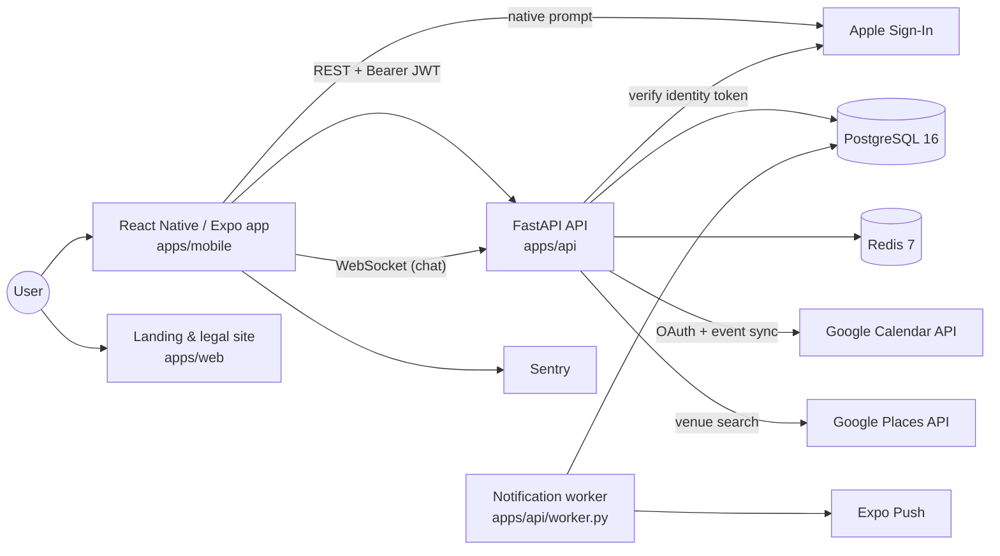

# Architecture

How Protin is put together, and why. This describes the system as implemented today —
not a target state.

---

## System context



The mobile app is the only product surface. `apps/web` is a small Vite site that hosts
the public privacy, terms and support pages the app links to — it is not a second
client and holds no application logic.

---

## Components

### Mobile app — `apps/mobile`

Expo 54 / React Native 0.81 / React 19, TypeScript throughout.

- **Navigation** — React Navigation, native-stack plus bottom tabs, with a root navigator
  that switches on authentication state.
- **State** — Zustand stores for auth and profile, screen-local state elsewhere. There is no
  general-purpose cache layer, though a few module-level session caches exist (for example
  the tournament-availability probe in `useTournaments.ts`).
- **Auth token** — the JWT is *persisted* in `expo-secure-store` (Keychain / Keystore)
  rather than AsyncStorage. For the life of a session it is also held in memory — in the
  Zustand auth store and in a module-level `_token` in `lib/api.ts` that the request
  helper reads — and cleared from all three on logout and on account deletion.
- **Native capability** — Apple Sign-In, location, maps, calendar, image picker and push
  registration are all Expo modules, so the app builds through EAS without custom native
  code.
- **Business rules** — none that are authoritative. The app does mirror some server rules
  for display purposes (`eventHasStarted`, challenge terminal-status checks) to grey out a
  control before the user taps it, but every decision that matters — who may transition a
  booking, what a match is worth, whether a result counts — is made and re-checked
  server-side. A client that lied about any of them would simply get a 4xx.

### API — `apps/api`

FastAPI on Python 3.12, async end to end.

```
app/
  core/       config (pydantic-settings), JWT + password hashing, field encryption, rate limiting
  db/         async SQLAlchemy engine + session, Redis client
  models/     14 ORM model modules
  schemas/    Pydantic request/response models
  routers/    15 routers — the HTTP layer only
  services/   17 service modules — all domain logic
```

The intended layering is **routers do HTTP, services do domain work**: a router unpacks
the request, resolves the authenticated user, calls one service function and returns its
result. That is what makes a rule reachable from HTTP, from the worker and from a test
without duplication, and it is why the booking, discovery, challenge, rank, event and
safety domains all keep their logic in `services/`.

The boundary is not uniform, and it is worth being precise about where it is not. The
two oldest routers predate the convention: `routers/auth.py` runs its registration and
login queries inline, and `routers/users.py` does its own profile lookup and upsert. Both
work and both are tested, but neither has a service module, so that logic is reachable
only over HTTP. Extracting them is the obvious cleanup; it has not been done.

### Worker — `apps/api/worker.py`

A separate long-running process sharing the API's models and services. It polls
`notification_events` for due rows and delivers them through Expo Push.

Deliberately simple: no task queue, no distributed locking, a single poller on a
configurable interval. That is honest for the current volume, and the notification
service is already factored so a Celery/Redis queue could replace the polling loop
without touching the callers that schedule events.

Splitting it out matters more than what it runs on — push fan-out is slow and
failure-prone, and the booking request that triggers it should not wait for it.

---

## Request flow

A representative write path — confirming a session:

```
POST /bookings/{id}/confirm
   │
   ├─ get_current_user           JWT decoded, user loaded            core/security.py
   ├─ router                     validates the body, delegates       routers/bookings.py
   └─ services/bookings.py
        ├─ _get_booking_or_404
        ├─ _assert_booking_participant     caller is proposer or partner
        ├─ _check_transition               (status, target) legal? actor permitted?
        ├─ mutate booking.status                    not committed yet
        ├─ rank_service.record_booking_transition   rank/honor rows, same session
        ├─ notifications.schedule(...)              rows written, nothing sent
        └─ db.commit()                              all three land atomically
   │
   └─ 200  BookingResponse
```

The single commit at the end is the point: the status change, the reputation ledger rows
and the queued notifications either all land or none do. Committing the status first
would allow a booking to be confirmed with no matching rank entry if the next step threw.

Push delivery happens later, out of band, when the worker next polls.

### The booking state machine

The HTTP surface is one route per action — `POST /bookings/{id}/confirm`, `/decline`,
`/cancel`, `/complete`, `/no-show` — but none of them decides anything. Each resolves to
a target status and hands off to a single `transition_booking` service function.

The rules live in one table: `(current_status, target_status)` mapped to which party may
perform the move (`proposer`, `partner` or `either`), checked before any state is
written. An illegal transition returns `422`; a legal transition attempted by the wrong
party returns `403`.

Encoding it as a table rather than scattering `if` statements across route handlers is
what keeps the rule auditable: the complete set of legal moves is readable in about
fifteen lines, and adding a status is a table edit rather than a hunt through the
codebase.

### Real-time chat

Messages have two paths in and one contract out. History and sending are ordinary REST
(`GET`/`POST /matches/{id}/messages`); delivery to the other participant is a WebSocket
room keyed by match id, held by an in-process connection manager.

Two details are worth calling out:

- **Authorisation gates room admission, not the handshake.** The handler decodes the JWT
  from the query string and confirms the caller is a participant of that match before
  registering the socket with the connection manager, so an unauthorised client is never
  added to a room and never receives a message. A rejected connection is accepted at the
  protocol level and then immediately closed with a distinct code — `1008` for an invalid
  token, `4003` for a valid token belonging to someone else's match — because the
  WebSocket protocol has no way to send a close reason on a connection that was never
  accepted. The check is before any data flows; it is not before `accept()`.
- **The client de-duplicates across three sources.** A message can arrive from the
  initial fetch, from the optimistic result of the client's own POST, and from a socket
  frame. `lib/messages.ts` merges all three into one ordered list rather than letting
  the screen render a duplicate.

The connection manager holds rooms in process memory, which means it does not survive a
restart and does not fan out across multiple API instances. A Redis pub/sub backplane is
the standard fix; it is not implemented, and the single-instance limitation is real.

### Rank and honor

There are two reputation subsystems with different trust models, and conflating them
would misrepresent both.

**Booking-derived rank and honor — `services/rank.py`.** `record_booking_transition` is
its only public emitter; the booking FSM calls it, and it writes `RankEvent` and
`HonorEvent` ledger rows in the same transaction as the status change. Two properties:

- **Tier is computed, never stored.** Deriving it from the point sum on read avoids a
  third source of truth that can drift out of sync with the ledger.
- **No-show claims cost the claimant too.** Either party may mark a confirmed session
  completed or no-show, so this input is effectively self-reported. The mitigation is
  that the caller takes a smaller penalty as well — a game-theoretic deterrent, not a
  dispute system. No dispute window is implemented, and the product copy says so.

**Competitive Honor System — `services/honor_system.py`.** Local rankings, titles,
win/loss streaks and `HonorHistory`. Its public API is **read-only**; the writer
(`record_match_result_for_honor`) has exactly one caller, `services/challenges.py`, which
fires it only once *both* participants have submitted matching results, and only on the
`accepted → verified` transition so a result can never be applied twice. A public
endpoint wrapping that writer would let any authenticated user mutate two other users'
rankings, streaks and title holdings — which is precisely why there isn't one.

---

## Data stores

**PostgreSQL 16** holds all durable state, accessed through async SQLAlchemy 2.0 over
asyncpg. Schema changes go through Alembic; there are 15 migrations and no manual DDL.

**Redis 7** is the runtime cache and rate-limit backend, and is health-checked on
`/health`. Nothing durable lives there — losing Redis degrades the service, it does not
lose data.

**Local media.** Profile photos are written to disk and served by `StaticFiles` under a
configurable URL prefix. Cloud object storage would replace the writer without changing
the URL shape. This is a known limitation on a multi-instance deployment and is called
out rather than hidden.

**Field-level encryption.** Google OAuth access and refresh tokens are encrypted at rest
with Fernet via a SQLAlchemy `TypeDecorator`, so the service layer reads and writes
plaintext and the ciphertext boundary sits at the column. With no key configured, values
carry a `plain:` sentinel prefix — and `validate_encryption_config()` refuses to start
the app in staging or production in that state. Staging is included deliberately: its
database dumps are retained as backups and would otherwise leak tokens.

---

## Integrations

| Integration | Used for | Absent key behaviour |
|---|---|---|
| Apple Sign-In | Identity-token verification at `/auth/apple`; token revocation on account deletion (App Store 5.1.1(v)) | Endpoint disabled; email/password unaffected |
| Google Calendar | OAuth connect; outbound export of a confirmed booking to the user's calendar. (`cancel_calendar_event` exists in the service but has no caller — cancelling a booking does not currently remove the calendar event.) | Export disabled |
| Google Places | Live venue density for the venue picker | Falls back to the seeded Sydney catalogue, no HTTP call |
| Expo Push | Notification delivery from the worker | Defaults to the live Expo endpoint, so this one must be set *explicitly empty* to disable. Once empty: events are still scheduled and stored, and each delivery attempt returns failure and is recorded as such |
| Sentry | Mobile crash and error reporting | Not initialised |

These are *optional* integrations: leaving one unset switches that feature off, or
records a delivery failure, without breaking an unrelated flow. That is what lets CI, and
an App Store reviewer's environment, run the product without production credentials.

A separate class of setting behaves the opposite way on purpose. `FIELD_ENCRYPTION_KEY`
and `INTERNAL_API_TOKEN` are **required** when `APP_ENV` is `staging` or `production`:
the app raises at startup rather than boot without them. Refusing to start is the correct
failure mode there — a service persisting unencrypted OAuth tokens, or exposing an
unauthenticated notification fan-out, is worse than a service that is down.

`SECRET_KEY` has the same intent but a weaker guard, and it is worth being precise about
the difference: the startup check rejects only the exact literal
`change-me-in-production`. An empty value, a short value, or a different placeholder
still boots and signs JWTs. Tightening that check to a real emptiness/length validation
is finding **C1** in the [security audit](../security/SECURITY_AUDIT.md) and remains
open.

---

## Package boundaries

```
apps/mobile ──imports──> packages/shared-types
apps/api    ──mirrors──> packages/shared-types   (by convention, enforced in review)
```

`packages/shared-types` is a source-only TypeScript package exporting the request and
response shapes as a barrel. Roughly two dozen non-test modules in the mobile app import
from it.

Two honest gaps, both worth stating plainly:

- **The types are not generated from the FastAPI OpenAPI schema.** The API side of the
  contract is upheld by convention and review rather than by a compiler, so the package
  guarantees client-side consistency, not client/server agreement.
- **Adoption is not complete.** `useTournaments` imports from the package directly and
  `useEvents` / `useChallenges` reach it through their `lib/` modules, but `useDiscovery`
  still declares `PartnerCard` and its action response inline. Those shapes can drift from
  the package without `tsc` noticing.

Where it is used, the package does buy the thing it was built for: a contract change
surfaces as a build failure rather than a runtime `undefined` on a user's phone.
Generating it from OpenAPI and migrating the remaining hooks onto it would close both
gaps; the barrel-only structure was chosen so that swap stays cheap.

---

## Key trade-offs

**Async everywhere.** Async SQLAlchemy is meaningfully more awkward than the sync API —
lazy loading is unavailable, so relationships need explicit `selectinload`. The payoff is
that a request blocked on Google Calendar or Places does not consume a worker thread.

**A separate worker over in-request delivery.** Costs a second process to deploy. Buys a
booking confirmation that returns immediately and a push failure that cannot fail a
booking.

**SQLite for the test suite.** The API tests run against in-memory SQLite rather than a
real PostgreSQL. That is why the suite needs no containers and runs in ~90 seconds — but
it also means PostgreSQL-specific behaviour is not exercised. The clearest example is
`with_for_update` in `join_tournament`, which SQLite ignores; the concurrency guarantee
it provides is reasoned about and documented rather than tested. See
[TESTING.md](../engineering/TESTING.md).

**Tournaments behind a feature flag.** List, join and leave are implemented; bracket
generation, result verification and rank integration are not. Rather than ship a
half-finished surface, the flag hides it in production builds. The feature is described
that way in this repository too — an unfinished feature named accurately is worth more
than a complete-sounding one that is not.

**Sydney-first.** The venue catalogue, suburb model and distance filters assume one city.
Generalising is a data problem rather than an architecture problem, which is why the
constraint was acceptable.
